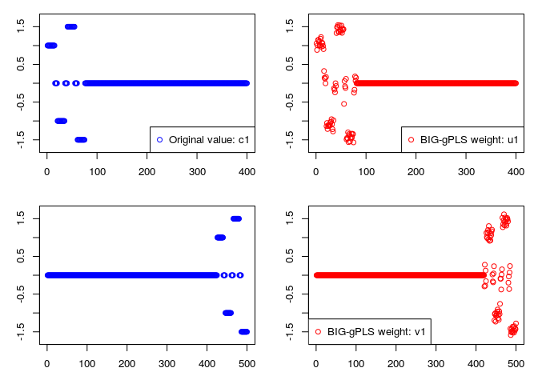
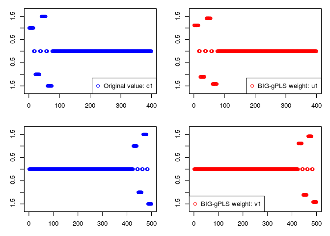

Big sgPLS
=========

`bigsgPLS` is an R package that provides an implementation of the two block PLS methods. A preliminary paper has been submitted describing the algorithm and will be made avaliable when the manuscript is accepted.

Big Group PLS (Test and Example)
--------------------------------

The code below checks the method returns the same results for gPLS (using the sgPLS package). The method is then applied to a large dataset (as used in the submitted article).

*See Also* [Example 2](Example-2-gPLS-DA.md), [Example 3](Example-3-PLS.md) and [general documentation](../README.md)

First test method against the gPLS method from sgPLS package to test performance.

``` r
data <- bigsgPLS::create.big.file.model.case1(ng = 1, chunk.size = 100)
ind.block.x <- data$ind.block.x; ind.block.y <- data$ind.block.y
X <- data$X; Y <- data$Y; theta.x1=data$theta.x1; theta.x2 <- data$theta.x2; 
theta.y1=data$theta.y1; theta.y2 <- data$theta.y2
p<-400; q <- 500

library(sgPLS)
model.gPLS <- gPLS(X, Y, ncomp = 2, mode = "regression", keepX = c(4, 4),
                   keepY = c(4, 4), ind.block.x =  ind.block.x, ind.block.y = ind.block.y)

library(bigsgPLS)
dataX <- as.big.matrix(X)
dataY <- as.big.matrix(Y)

model.group.sparse <- bigsgpls(dataX, dataY, regularised = "group",
                               keepX = c(4,4), keepY = c(4,4),
                               ind.block.x = ind.block.x,
                               ind.block.y = ind.block.y,
                               H = 2, case = 4, epsilon = 10 ^ -6, ng = 2)

# Check the variates and loadings match
# max(abs(model.gPLS$variates$X) - abs(model.group.sparse$variates$X));
# max(abs(model.gPLS$variates$Y) - abs(model.group.sparse$variates$Y));
# max(abs(model.gPLS$loadings$X) - abs(model.group.sparse$loadings$X));
# max(abs(model.gPLS$loadings$Y) - abs(model.group.sparse$loadings$Y))
```

Comparing the results to the true model visually.

``` r
eps <- 0.2
x <- 1:p
par(mfrow=c(2,2),mar=c(3,3,1,1)+0.1)
norm_const <- sqrt(sum(theta.x1**2))  
plot(theta.x1~x,ylab=c(""),xlab="",col="blue",ylim=c(-1.5-eps,1.5+eps))
legend("bottomright",legend="Original value: c1",col="blue",pch=1)
plot(-norm_const*model.group.sparse$loadings$X[,1]~x,col="red",ylab=c(""),xlab="",ylim=c(-1.5-eps,1.5+eps))
legend("bottomright",legend="BIG-gPLS weight: u1",col="red",pch=1)
norm_const <- sqrt(sum(theta.y1**2))
y <- 1:q
plot(theta.y1~y,ylab=c(""),xlab="",col="blue",ylim=c(-1.5-eps,1.5+eps))
plot(-norm_const*model.group.sparse$loadings$Y[,1]~y,col="red",ylab=c(""),xlab="",ylim=c(-1.5-eps,1.5+eps))
legend("bottomleft",legend="BIG-gPLS weight: v1",col="red",pch=1)
```



Running on a big data example
-----------------------------

Choose a directory for the data to be generated. Example from paper. Large n for X and Y matrix.

``` r
#--- Create some example data ---#

fileX <- "../data/X.csv"
fileY <- "../data/Y.csv"

#create.big.file.model.case1(fileX = fileX, fileY = fileY, size.min=5, p=400, q=500,chunk.size=10000)

#-- Check the file size for the Y matrix --#
file.info(fileY)$size
```

    ## [1] 5016152561

``` r
library(doParallel)
registerDoParallel(cores = 2)
getDoParWorkers()
```

    ## [1] 2

``` r
#-- Read the X data using bigmemory package --#
dataX <- read.big.matrix(fileX, header = FALSE, backingfile = "X.bin", descriptorfile = "X.desc", type = "double")

#-- Read the Y data using bigmemory package --#
dataY <- read.big.matrix(fileY, header = FALSE, backingfile = "Y.bin", descriptorfile = "Y.desc", type = "double")

system.time(
  model.group.sparse.big <- bigsgpls(dataX, dataY, regularised = "group",keepX = c(4,4),
                                     keepY = c(4,4),ind.block.x = ind.block.x ,
                                     ind.block.y = ind.block.y, H = 1, case = 4,
                                     epsilon = 10 ^ -6, ng = 100)
)
```

    ##    user  system elapsed 
    ## 224.272  20.660 139.425

``` r
#--- Run plots to get the weight vector estimates ---#
eps <- 0.2
x <- 1:p
par(mfrow=c(2,2),mar=c(3,3,1,1)+0.1)
norm_const <- sqrt(sum(theta.x1**2))  
plot(theta.x1~x,ylab=c(""),xlab="",col="blue",ylim=c(-1.5-eps,1.5+eps))
legend("bottomright",legend="Original value: c1",col="blue",pch=1)
plot(-norm_const*model.group.sparse.big$loadings$X[,1]~x,col="red",ylab=c(""),xlab="",ylim=c(-1.5-eps,1.5+eps))
legend("bottomright",legend="BIG-gPLS weight: u1",col="red",pch=1)

norm_const <- sqrt(sum(theta.y1**2))
y <- 1:q
plot(theta.y1~y,ylab=c(""),xlab="",col="blue",ylim=c(-1.5-eps,1.5+eps))
plot(-norm_const*model.group.sparse.big$loadings$Y[,1]~y,col="red",ylab=c(""),xlab="",ylim=c(-1.5-eps,1.5+eps))
legend("bottomleft",legend="BIG-gPLS weight: v1",col="red",pch=1)
```


