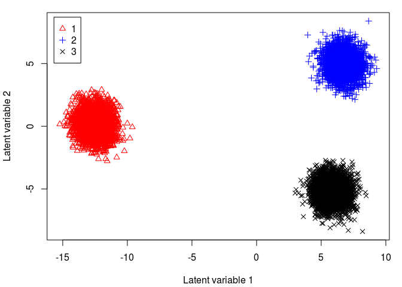

Big sgPLS
=========

`bigsgPLS` is an R package that provides an implementation of the two block PLS methods. A preliminary paper has been submitted describing the algorithm and will be made avaliable when the manuscript is accepted.

Big Group PLS Discriminant Analysis
-----------------------------------

The code below replicates the discrimination analysis example. Choose a directory for the data to be generated.

*See Also* [Example 1](Example-1-gPLS.md), [Example 3](Example-3-PLS.md) and [general documentation](../README.md)

``` r
library(bigsgPLS)
fileX <- "../data/Xda.csv"
fileY <- "../data/Yda.csv"

create.big.file.model.case3(size.min = 5000000000, chunk.size = 9000, fileX = fileX, fileY = fileY)

#-- Check the file size for the X matrix --#
file.info(fileX)$size
```

    ## [1] 5056289335

``` r
library(doParallel)
registerDoParallel(cores = 2)
getDoParWorkers()
```

    ## [1] 2

``` r
#-- Read the X data using bigmemory package --#
dataX <- read.big.matrix(fileX, header = FALSE, backingfile = "Xda.bin", descriptorfile = "Xda.desc", type = "double")
dataY <- read.big.matrix(fileY, header = FALSE, backingfile = "Yda.bin", descriptorfile = "Yda.desc", type = "double")

dim(dataX); dim(dataY)
```

    ## [1] 486000    600

    ## [1] 486000      3

``` r
#-- Set the block structure from the paper --#
ind.block.x <- seq(100, 500, 100)

#-- Run the Unified Algorithm with group regularisation --#
model.group.sparse.da <- bigsgpls(dataX, dataY, regularised = "group",
                               keepX = c(3,3),keepY = NULL,ind.block.x = ind.block.x, 
                               ind.block.y = NULL, H = 2, case = 4, epsilon = 10 ^ -6, ng = 100)

#-- Return the PLS X and Y scores --#
xi <- model.group.sparse.da$variates$X
omega <- model.group.sparse.da$variates$Y

#-- Find the selected variables --#
which(model.group.sparse.da$loadings$X[,1]!=0)
```

    ##   [1]   1   2   3   4   5   6   7   8   9  10  11  12  13  14  15  16  17
    ##  [18]  18  19  20  21  22  23  24  25  26  27  28  29  30  31  32  33  34
    ##  [35]  35  36  37  38  39  40  41  42  43  44  45  46  47  48  49  50  51
    ##  [52]  52  53  54  55  56  57  58  59  60  61  62  63  64  65  66  67  68
    ##  [69]  69  70  71  72  73  74  75  76  77  78  79  80  81  82  83  84  85
    ##  [86]  86  87  88  89  90  91  92  93  94  95  96  97  98  99 100 101 102
    ## [103] 103 104 105 106 107 108 109 110 111 112 113 114 115 116 117 118 119
    ## [120] 120 121 122 123 124 125 126 127 128 129 130 131 132 133 134 135 136
    ## [137] 137 138 139 140 141 142 143 144 145 146 147 148 149 150 151 152 153
    ## [154] 154 155 156 157 158 159 160 161 162 163 164 165 166 167 168 169 170
    ## [171] 171 172 173 174 175 176 177 178 179 180 181 182 183 184 185 186 187
    ## [188] 188 189 190 191 192 193 194 195 196 197 198 199 200 201 202 203 204
    ## [205] 205 206 207 208 209 210 211 212 213 214 215 216 217 218 219 220 221
    ## [222] 222 223 224 225 226 227 228 229 230 231 232 233 234 235 236 237 238
    ## [239] 239 240 241 242 243 244 245 246 247 248 249 250 251 252 253 254 255
    ## [256] 256 257 258 259 260 261 262 263 264 265 266 267 268 269 270 271 272
    ## [273] 273 274 275 276 277 278 279 280 281 282 283 284 285 286 287 288 289
    ## [290] 290 291 292 293 294 295 296 297 298 299 300

``` r
which(model.group.sparse.da$loadings$X[,2]!=0)
```

    ##   [1]   1   2   3   4   5   6   7   8   9  10  11  12  13  14  15  16  17
    ##  [18]  18  19  20  21  22  23  24  25  26  27  28  29  30  31  32  33  34
    ##  [35]  35  36  37  38  39  40  41  42  43  44  45  46  47  48  49  50  51
    ##  [52]  52  53  54  55  56  57  58  59  60  61  62  63  64  65  66  67  68
    ##  [69]  69  70  71  72  73  74  75  76  77  78  79  80  81  82  83  84  85
    ##  [86]  86  87  88  89  90  91  92  93  94  95  96  97  98  99 100 101 102
    ## [103] 103 104 105 106 107 108 109 110 111 112 113 114 115 116 117 118 119
    ## [120] 120 121 122 123 124 125 126 127 128 129 130 131 132 133 134 135 136
    ## [137] 137 138 139 140 141 142 143 144 145 146 147 148 149 150 151 152 153
    ## [154] 154 155 156 157 158 159 160 161 162 163 164 165 166 167 168 169 170
    ## [171] 171 172 173 174 175 176 177 178 179 180 181 182 183 184 185 186 187
    ## [188] 188 189 190 191 192 193 194 195 196 197 198 199 200 201 202 203 204
    ## [205] 205 206 207 208 209 210 211 212 213 214 215 216 217 218 219 220 221
    ## [222] 222 223 224 225 226 227 228 229 230 231 232 233 234 235 236 237 238
    ## [239] 239 240 241 242 243 244 245 246 247 248 249 250 251 252 253 254 255
    ## [256] 256 257 258 259 260 261 262 263 264 265 266 267 268 269 270 271 272
    ## [273] 273 274 275 276 277 278 279 280 281 282 283 284 285 286 287 288 289
    ## [290] 290 291 292 293 294 295 296 297 298 299 300

``` r
#-- Get a subset of the PLS X-scores for plotting --#
xiselect <- xi[1:9000,]

par(mfrow=c(1,1))
y1 <- range(xiselect[,1])
x1 <- range(xiselect[,2])

#-- Plot the X-scores for the first two components --#
par(mfrow=c(1,1),mar=c(4,4,1,1)+0.1)
plot(-4:4, -4:4, type = "n",ylim=x1,xlim=y1,xlab="Latent variable 1",ylab="Latent variable 2")
points(xiselect[1:3000,1],xiselect[1:3000,2],col="red",pch=2)
points(xiselect[3001:6000,1],xiselect[3001:6000,2],col="blue",pch=3)
points(xiselect[6001:9000,1],xiselect[6001:9000,2],col="black",pch=4)
legend("topleft",inset=0.02,c("1","2","3"),col=c("red","blue","black"),pch=c(2,3,4))
```


