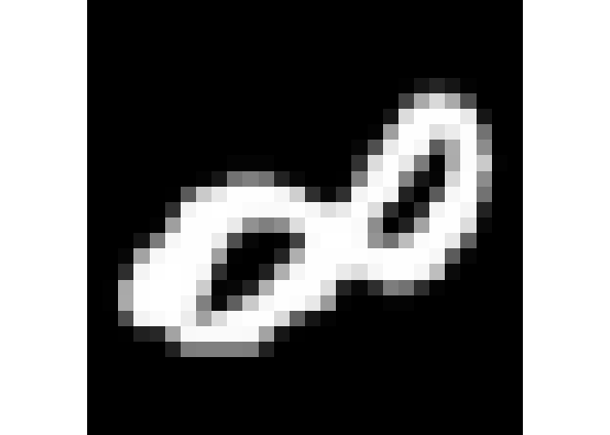

Big sgPLS
=========

`bigsgPLS` is an R package that provides an implementation of the two block PLS methods. The method makes use of bigmemory and matrix algebra by chunks to deal with datasets too large for R.

Big PLS (EMNIST)
----------------------

``` r
library(bigsgPLS)
fileX <- "../data/emnist_images_training_set.csv"
fileY <- "../data/emnist_labels_training_set.csv"

#-- Check the file size for the Y matrix --#
file.info(fileX)$size
```

    ## [1] 463610839

``` r
library(doParallel)
registerDoParallel(cores = 2)
getDoParWorkers()
```

    ## [1] 2

``` r
#-- Read the training data using bigmemory package --#
dataX <- read.big.matrix(fileX, header = FALSE, backingfile = "X.bin", descriptorfile = "X.desc", type = "double")
Y <- mixOmics::unmap(read.csv(fileY, header = F)[,1])
dataY <- as.big.matrix(Y, backingfile = "Y.bin", descriptorfile = "Y.desc", type = "double")

#-- Make plot --#
library(EBImage)
display(getFrame(Image(as.integer(t(dataX[1,])),c(28,28, 5)),1)/255, method = "raster", interpolate = FALSE)
```



``` r
model.group.sparse.big <- bigsgpls(dataX, dataY, H = 20, case = 4, ng = 20)

#-- Read the test data --#
fileX <- "../data/emnist_images_test_set.csv"
fileY <- "../data/emnist_labels_test_set.csv"
X.test <- as.matrix(read.csv(fileX, header = F)) # remove rowname column
Y.test <- read.csv(fileY, header = F)

predpls <- predict(model.group.sparse.big, newX = X.test,ng = 1, comps = 20, da = T)
mean(predpls$classes - 1 == Y.test,na.rm=TRUE)
```

    ## [1] 0.860225
